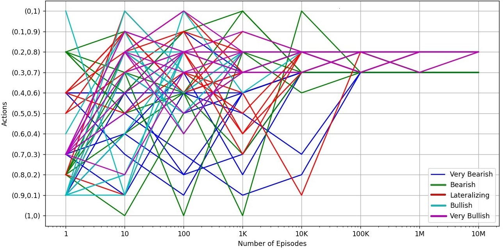
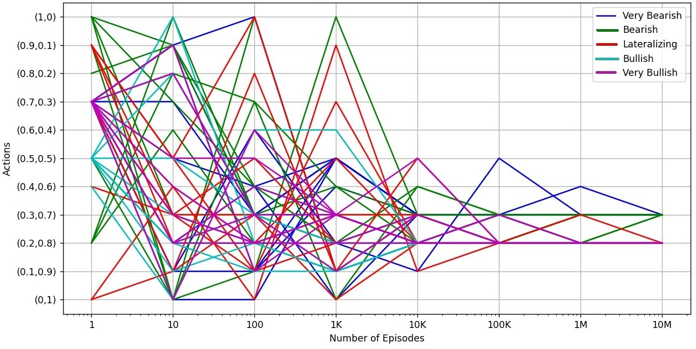

# etf-builder
The ETF builder is a Q-Learning algorithm which, given a certain stock index, generates the optimal ETF tracker.
In what follows we are going to discuss the project step by step.
## The Setup

The Imaginary (IMG) index is an equal weighted index, where the price of each component directly affects the price of the index with a weight of 1 over the number of stocks. It lists 4 stocks belonging to the following companies:

- "Unreal" (UNR)
- "Abstract" (ABS)
- "Fictitious" (FIC)
- "Invented" (INV)

The index starts with an initial value calculated from the stock prices on the first day of listing:
- UNR: $10
- ABS: $12
- FIC: $14
- INV: $16

Thus, the index starts at a value of $13.

Each stock has different attributes. The real volatility of the stocks, in descending order, is as follows:
- ABS: 0.5
- UNR: 0.3
- INV: 0.2
- FIC: 0.1

Furthermore, the correlation structure of the four stocks is represented by the following correlation matrix Σ:

|       Σ     | UNR  | ABS  | FIC  | INV  |
|-------------|------|------|------|------|
| UNR         | 1    | 0.2  | 0.6  | 0.4  |
| ABS         | 0.2  | 1    | 0.001| -0.8 |
| FIC         | 0.6  | 0.001| 1    | -0.3 |
| INV         | 0.4  | -0.8 | -0.3 | 1    |

## Step 1: Modelling the RL problem

First and foremost, we need to define a Markov Decision Process (MDP) problem. Ultimately, the goal is to define a decision rule that will associate to each state $i$ an action $a$, in a stationary and deterministic setting. In fact, the MDP framework converges if the policy is of the kind: $\pi: I \rightarrow A$.

Thus, we need to define the problem by specifying the state-space $I$ and the action space $A$, and how the process receives inputs, thus the cost function.

Regarding the state-space, one initial guess would be to report something related to the stock prices, but the problem is their non-stationarity. Therefore, we would get something along the lines of solving the following problem: $\pi: I^{n+1} \rightarrow A$, since the evolution in time of the stock prices will bring them away from their initial variability space due to their nature, and this framework does not comply with MDP convergence guarantees.

To solve this problem, we will consider returns, which we know from literature to be stationary, along with having mean 0, heavy-tailed distribution, and negative asymmetry, among other characteristics. Since actually considering returns as states would yield a state space that is too big, we could model the states depending on the return we randomly draw from the distribution of returns. In this way:

- If the return is less than $-0.15$, we are in a "very bearish" state, thus the index is possibly in an unhealthy position at that moment.
- If the return is between $-0.05$ and $-0.15$, we are in a "bearish" state, thus the index is possibly either starting to contract or correcting.
- If the return is between $-0.05$ and $0.05$, we are in a "lateralizing" state, thus the index is possibly in a rather calm, uneventful state.
- If the return is between $0.05$ and $0.15$, we are in a "bullish" state, thus the index is possibly in a healthy position or only correcting.
- If the return is more than $0.15$, we are in a "very bullish" state, thus the index is possibly in an enthusiastic upward direction.

This will possibly yield some problems, especially if we consider the fact that, in this way, the cost function will not depend on the state but rather on the return observed, but we are ready to pay this cost for the sake of applicability.

The Markov Chain, in this case, is a process that will take values from 0 (the "very bearish" state) to 4 (the "very bullish" state), evidently complying with the theory presented earlier in the thesis. As stated earlier, the states can be, without loss of generality, integers representing concepts, in our case the concept is the state of the index.

Our goal will then be to understand how to adjust the weights in each one of these situations. For the action space, we are going to model eleven different prefixed weight combinations that the agent can try, in order to balance out the variety of combinations and the complexity of the action space. An action space that is too big could present the problem that the consequences of each action are not explored in each state adequately often. On the other hand, an action space that is too small would not encompass any complexity to the problem.

Since the index is formed by four stocks, we deliberate that choosing two stocks among them should be enough to track it. We conclude that the companies "Abstract" and "Fictitious" are perfect for the job, since our research showed that their correlation is confidently enough around $0$. Diversification is fundamental when building an ETF, since it follows more or less the same mathematical principles of a factorization. One could argue that building an ETF is somewhere along the lines of performing a principal components analysis.

So all that is left to do now is to decide the weights to assign to each stock in our ETF. Furthermore, we constantly rearrange our weights to proficiently track the market, so the tracking weights vary from state to state. These eleven actions will be combinations of weights that vary in the order of $0.1$ (0.1 of a stock and 0.9 of the other, 0.2 and 0.8, and so on).

Heuristically, using the tracking error between the ETF and the index is an easy choice for the cost function. The analysis we would like to perform will use the past 100 days in which the index has evolved. However, we will use the return distribution to make the decision, without directly considering the time series itself, to avoid over-fitting.

The learning rate was initially chosen to be $1/t$, but it was decreasing too fast, not allowing the algorithm to learn correctly. Hence, a learning rate of $(1/t)^{0.51}$ was chosen to decrease more slowly while still respecting the discussed assumptions.

The cost function, i.e., the tracking error, was yielding values that were too small. Therefore, instead of multiplying the value of the tracking error by a constant, the cost function is modelled so that in each episode, ten random returns from the current state are selected, and the tracking error is summed up.

To define the data set, we simulate the stock evolution via a discrete Geometric Brownian Motion simulation. This simulation is then used to get the returns that govern the transition between states.

## Step 2: Simulating the index

In our overtly simple example, the natural evolution of the stock abides by the laws of financial mathematics theory. Hence, all four stocks are modeled following a Geometric Brownian Motion (GBM). Despite the GBM being a continuous process, we consider a discretized version of it. The Markov Chain considered does not directly depend on this simulation; it is solely used to generate the dataset.

The relative challenge lied in ensuring the consideration of correlation between the assets, requiring the implementation to model correlated GBMs. To achieve this, theory suggests utilizing the Cholesky decomposition on the matrix $\Sigma$ and then utilizing the resulting values to model the four GBMs.

The Cholesky decomposition decomposes a Hermitian, positive-definite matrix into the product of a lower triangular matrix and its conjugate transpose. The resulting lower triangular matrix $L$ satisfies:

\[
LL^\intercal = \Sigma
\]

and is composed of the following values:

\[
L
=
1 & 0 & 0 & 0 \\
0.2 & 0.9798 & 0 & 0 \\
0.6 & -0.3804 & 0.6714 & 0 \\
0.4 & -0.8185 & 0.2980 & 0.8455 \\
\]

We utilize the elements of this matrix to model the correlated Brownian Motions in the GBM processes as follows:
- $\Tilde{B}_1 = B_1*l_{11}$
- $\Tilde{B}_2 = B_1*l_{21} + B_2*l_{22}$
- $\Tilde{B}_3 = B_1*l_{31} + B_2*l_{32} + B_3*l_{33}$
- $\Tilde{B}_4 = B_1*l_{41} + B_2*l_{42} + B_3*l_{43} + B_4*l_{44}$

Where $l_{kj}$ are elements of the $L$ matrix, and the $B_i$s, for $i = 1,2,3,4$, represent uncorrelated Brownian Motions.

## ETF Portfolio Allocation Strategy Results

In general, the ETF shall hold 80% of the "Fictitious" company's stock and 20% of the "Abstract" company's stock. When the index is in a bearish phase, indicated by a return under $-0.05$, the ETF shall re-balance to hold 70% of the "Fictitious" company's stock and 30% of the "Abstract" company's stock.

This allocation strategy is reasonable, particularly due to our observation of the index evolution. The "Fictitious" company performs exceptionally well, acting as a stable, ever-growing company that acts as a primary engine for the index. However, its low volatility at $0.1$ means that composing our portfolio exclusively of FIC stocks could result in not capturing minor fluctuations effectively. Hence, the algorithm allocates 20% of the budget to the "Abstract" company, the most volatile of the group. This allocation serves as a correcting mechanism for our portfolio, guiding the ETF in the right direction with minor corrections.

At first glance, rebalancing in favor of the most volatile stock during times of market stress could seem counter-intuitive. However, this happens because the FIC stock performs exceptionally well, making negative returns rare for this stock. Consequently, the algorithm concludes that more ABS stocks are needed to grasp market downturns.

With this tracking path, the average tracking error measured on the known time series of 99 returns is about $0.008$. While it's not the smallest average tracking error possible, it's encouraging as it suggests that we are possibly avoiding over-fitting on our data.

## Ensuring Convergence of Optimal Policy

The final step is to ensure that the result obtained was not a lucky instance but instead the optimal policy to which we shall observe convergence. To ensure convergence, we need to make sure that we are respecting the assumptions discussed earlier in the thesis.

As observed, the learning rate of $(1/t)^{0.51}$ respects the assumptions on divergence and convergence. We also need to ensure that each state is explored "infinitely" often, and that each action is applied to each state "infinitely" often. The first condition is achieved by a general random access to each state governed by the distribution of returns, while the second condition is achieved by the epsilon greedy strategy we used, with $\epsilon = 0.05$. Although a greedy in the limit strategy was experimented, it did not ensure full exploration of all possible scenarios, thus it was not employed in the final experiment.

To check convergence, we ran the algorithm for a number of episodes ranging from 1 to 10 million, increasing each time by ten times, and for each run, we observed ten simulations. We should expect that in the iteration of 10 million episodes, we would have the same policy for each of the ten simulations, and this is the case, as shown in the plot below.

*Figure 1: Convergence plot*

In this plot, the y-axis represents the possible actions, the x-axis represents the number of episodes ran, the colors represent the different states, and for each state, we report the optimal action over 10 simulations, which are all displayed.

For further proof of robustness, we switched the order of the actions so that the action space is exactly mirrored with respect to the previous one. To no surprise, we obtained the same final result, as reported in the plot below.

*Figure 2: Convergence plot - Switched actions*

In this plot, the structure is similar to the previous one, but with the y-axis inverted.
